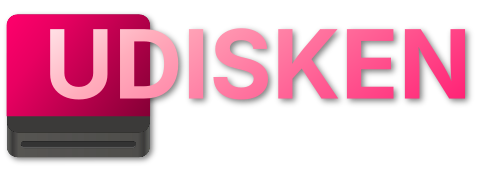

<!--
SPDX-FileCopyrightText: 2025 Sofian-Hedi Krazini <sofian-hedi.krazini@proton.me>
SPDX-License-Identifier: CC0-1.0
-->

# 

> [!NOTE]
> UDISKEN is not quite finished. A few features are planned, such as unlocking
> (see the note below). They will be implemented once I'm experienced with Qt.

A small Linux desktop removable media mounting daemon, that uses little memory.
(\~13x fewer memory used than [udiskie] on author's setup: from \~80 MiB to \~6
MiB)

Mount automatically your...:

- USB drive
- CD or DVD disk
- loop devices

> [!NOTE]
> Unlocking encrypted disks is not supported yet.
> Some preliminary work has been done in the
> [unlock](https://github.com/shkrazini/udisken/src/branch/unlock)
> branch.

## Requires

- [sdbus-c++] 2.1.0 or later
- [spdlog] 1.15.0 or later
- [UDisks] 2.10.0 or later
- `xdg-open(1)` (optional)
- [argparse] 3.1 or later (building only)

## Install

### Arch Linux User Repository (AUR)

Available as [udisken](https://aur.archlinux.org/packages/udisken),
[udisken-bin](https://aur.archlinux.org/packages/udisken-bin) (binary releases)
or [udisken-git](https://aur.archlinux.org/packages/udisken-git)
(development branch).

```sh
paru -S udisken
# ...or...
yay -S udisken
# ...or...
aurwrapperx -S udisken
```

## Running

UDISKEN provides a systemd user service. You can enable it using:

```sh
systemctl --user enable udisken.service
```

You can also simply run the daemon like this:

```sh
udisken
```

## Configuring

UDISKEN takes a few command arguments.

Disabling notifications:

```sh
udisken --no-notify
```

Disabling log timestamp (useful for journal systems, `journalctl`):

```sh
udisken --no-log-timestamp
```

Enabling verbose mode:

```sh
udisken -d # or --verbose
```

UDISKEN also reads from some environment variables.

Disabling notifications:

```sh
UDISKEN_NO_NOTIFY=1 udisken
```

Disabling log timestamp (useful for journal systems, `journalctl`):

```sh
UDISKEN_NO_LOG_TIMESTAMP=1 udisken
```

Enabling verbose mode:

```sh
DEBUG=1 udisken
```

**Other configuration**, such as _enabling or disabling automounting per drive_,
is best done in lower-level configuration files or tools, such as [fstab(5)].

If done so, this will allow UDISKEN and other programs to respect such
settings.

To **manually mount, unmount, or do something else**, you should use
[udisksctl(1)]: it is simple enough to use and supports shell completion in
Bash, Fish, and Zsh\*; simply remember to add `-b|--block-device`, like this:

```sh
udisksctl mount -b /dev/sdXN
```

\*_Requires [zsh-completions] installed._

## Building

### Prepare

You will need to have the [Meson] build system installed in order to build
UDISKEN.

Additionally, you will need the dependencies [listed above](#requires). Some
dependencies are optional, and you can choose to enable or disable the features
that require them in `meson.options`.

> [!IMPORTANT]
> Make sure that the D-Bus API interface file option is correct before running
> this command: see [UDisks D-Bus API bindings](#udisks-d-bus-api-bindings)

#### UDisks D-Bus API bindings

You absolutely need to have [sdbus-c++] installed, which provides the
`sdbus-c++-xml2cpp` program required for this step.

Simply make sure that the option `udisks_dbus_interface` in the project root
`meson.build`, points to the correct D-Bus interface XML file: this
corresponds to the Meson option being yielded to, as mentioned in
udisks-sdbus-c++'s README file.
Alternatively, you can provide the `udisks_dbus_interface` option when running
`meson setup`:

```sh
meson setup build -Dudisks_dbus_interface=/path/to/org.freedesktop.UDisks2.xml
```

The file's location may vary depending on your distribution.

- Usually, it is located in the `/usr/share/dbus-1/interfaces/`
  system directory.
- In the [UDisks] upstream repository, it is located at
  [data/org.freedesktop.UDisks2.xml]
- Alternatively, you may change the file location in the root project
  `meson.build`

For more information, see [udisks-sdbus-c++].

### Build

```sh
git clone https://github.com/shkrazini/udisken
cd udisken
meson wrap update-db
meson setup build
meson compile -C build
```

## Copyright

Copyright © 2025-2026 Sofian-Hedi Krazini

Source and header files are licensed under the [GNU General Public License
Version 3](./LICENSES/GPL-3.0-or-later.txt).

This README is marked [CC0 1.0 Universal](./LICENSES/CC0-1.0.txt).

UDISKEN Icon and UDISKEN Logo is based on Adwaita Icon Theme by the [GNOME
Project] originally licensed under
[CC-BY-SA-3.0](https://creativecommons.org/licenses/by-sa/3.0/), modified and
licensed under [CC-BY-SA-4.0](./LICENSES/CC-BY-SA-4.0.txt).
UDISKEN Icon and UDISKEN Logo uses [Inter], licensed under the [SIL Open Font
License 1.1](https://openfontlicense.org/open-font-license-official-text).

Other files are licensed under the
[BSD Zero Clause License](./LICENSES/0BSD.txt).

---

My first real project; others were either underdeveloped or abandoned.

[argparse]: https://github.com/p-ranav/argparse
[data/org.freedesktop.UDisks2.xml]: https://github.com/storaged-project/udisks/blob/master/data/org.freedesktop.UDisks2.xml
[fstab(5)]: https://man.archlinux.org/man/fstab.5
[GNOME Project]: https://www.gnome.org
[Inter]: https://rsms.me/inter
[Meson]: https://mesonbuild.com/SimpleStart.html#installing-meson
[sdbus-c++]: https://github.com/Kistler-Group/sdbus-cpp
[spdlog]: https://github.com/gabime/spdlog
[udiskie]: https://github.com/coldfix/udiskie
[UDisks]: https://github.com/storaged-project/udisks
[udisks-sdbus-c++]: https://github.com/shkrazini/udisks-sdbus-cpp
[udisksctl(1)]: https://man.archlinux.org/man/udisksctl.1.en
[zsh-completions]: https://github.com/zsh-users/zsh-completions
